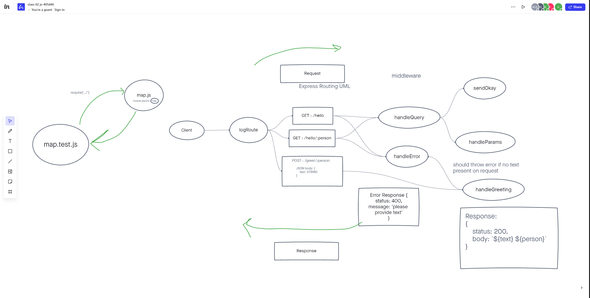

# Basic-Express-Server

As the name suggest, this is a **B**asic **E**xpress **S**erver!
We built this app in code 401 as a means of practicing getting an Express server up and running.

[Heroku Link]()

[Github Repo](https://github.com/AndresMillsGallego/basic-express-server)

## Installation

To install this app just follow these steps:

- Clone down this repo
- npm install

And that is it!

## Usage

This app is a good way to practice getting a **B**asic **E**xpress **S**erver running.

## Contributors / Authors

Project by: Andres Mills Gallego

[My GitHub](https://github.com/AndresMillsGallego)

[My LinkedIn](https://www.linkedin.com/in/andres-mills-gallego/)

## Features / Routes

At this point we only have a `GET` request active.  
This app uses `Express`, `Dotenv`, `Supertest` and `Jest`

